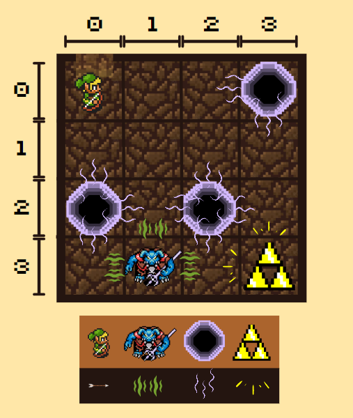

 

<strong>Universidade Federal do Pará || Campus Universitário de Tucuruí || Faculdade de Engenharia Elétrica</strong>\
<strong>Alessandro de Araújo Fonseca || Kevin Martins Medeiros || Sávio Milhomens de Sousa </strong>

 

# MUNDO DE WUMPUS - Intelegência Computacional

O mundo de Wumpus é um ambiente de simulação usado para ensinar conceitos de inteligência artificial e aprendizado por reforço. Nesse ambiente, o objetivo é que o Agente, controlado pelo algoritmo de inteligência artificial, encontre o Ouro e saia da Caverna sem ser comido pelo monstro Wumpus ou cair em um Poço. Para isso, o agente precisa coletar informações sobre o ambiente e tomar decisões com base nessas informações. 

  

 
A metodologia de estudo de inteligência computacional usando o mundo de Wumpus é muito útil porque permite que os alunos aprendam conceitos teóricos de IA de uma forma prática e interativa. Além disso, o mundo de Wumpus pode ser facilmente adaptado para diferentes níveis de complexidade, permitindo que os estudantes progridam em sua aprendizagem.

# ETAPAS DO PROJETO
O objetivo da criação do Mundo do Wumpus é a apredizagem com o desenvolvimento de inteligência artificial, para isso, gradativamete será entregue inteligência ao Agente para que ele possa resolver os problemas de forma mais eficiente. Essa evolução do Agente será realizada nas seguintes etapas.

